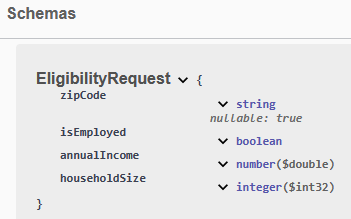
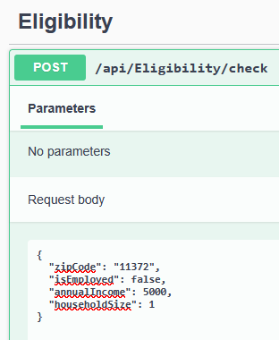
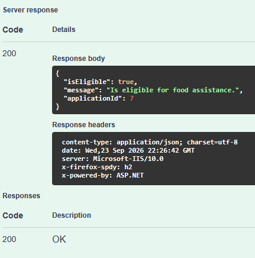
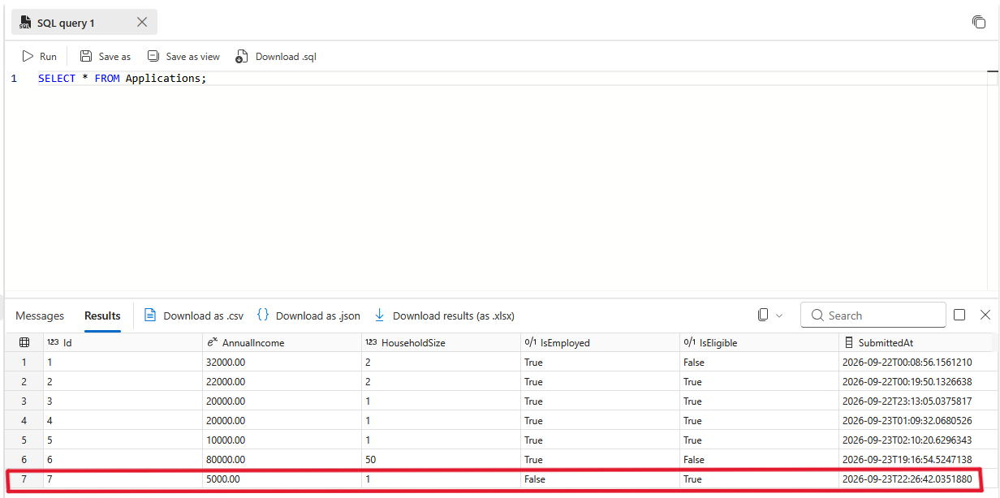

# Benefit Eligibility API (Proof of Concept)

This project is a proof of concept for creating REST APIs using ASP.NET Core and Azure to demonstrate eligibility logic for state benefit programs (Food Assistance, Unemployment).

## File Structure
- BenefitEligibilityApi/: Contains the API, Controller, Service, and Model.
- BenefitEligibilityApi.Tests/: Contains xUnit tests for the "BenefitEligibilityApi" project.

## Tech Stack
- **Backend:** .NET 8, ASP.NET Core
- **Database:** Azure SQL Database, Entity Framework Core
- **Security:** Azure Key Vault, Managed Identities
- **CI/CD:** GitHub Actions (Automated Build & Test on Push)
- **Manual Deployment:** Docker images built and pushed locally to Docker Hub

## Security & Configuration
- **Environment Separation:** Local development uses launchSettings.json (excluded from Git).
- **Secrets Management:** I currently store sensitive connection strings and credentials in Azure Key Vault but commented out retrieval for now due to container issues.

*Note: `appsettings.Development.json` and `launchSettings.json` are currently excluded from version control to protect local secrets.*

## Testing Strategy
- **Unit Testing:** xUnit is used to isolate and test business logic (e.g., eligibility calculation rules) without external dependencies.
- **CI/CD Integration:** Every push triggers an automated pipeline that restores dependencies, builds the solution, and runs all tests.

## Containerization
- **Docker:** Implemented a multi-stage build in the `Dockerfile` to create a container and pushed it to Docker Hub.
- **Container Filter:** A .dockerignore file ensures local development secrets (launchSettings.json) are excluded from the Docker image.
- **Optimization:** Separates the build environment (SDK) from the runtime environment (ASP.NET) to reduce image size.
- **Deployment:** Successfully deployed to an Azure App Service.

## Deployment Status

- **Azure App Service:** Deployed and functional.
- **Docker Hub:** Public repository with container image.
- **GitHub Actions:** Automated Build & Test pipeline (visible on Actions tab of this repo).

## Deployment Proof

Here are screenshots confirming successful deployment and functionality:

*Swagger interface with request schema*

*Swagger interface with sample request*

*Swagger interface with request response*

*SQL Database tables created and data persisted*

